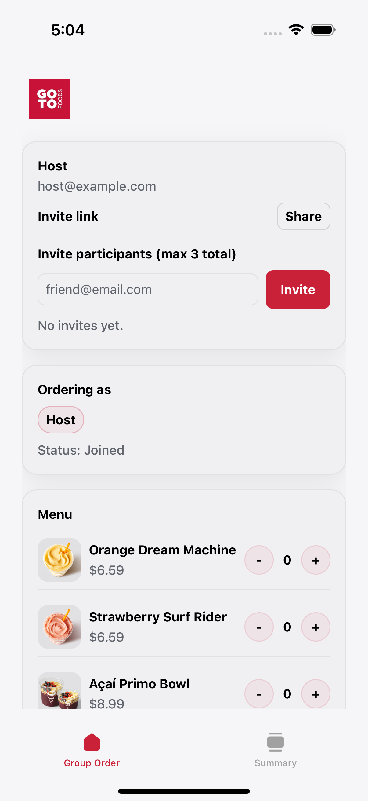
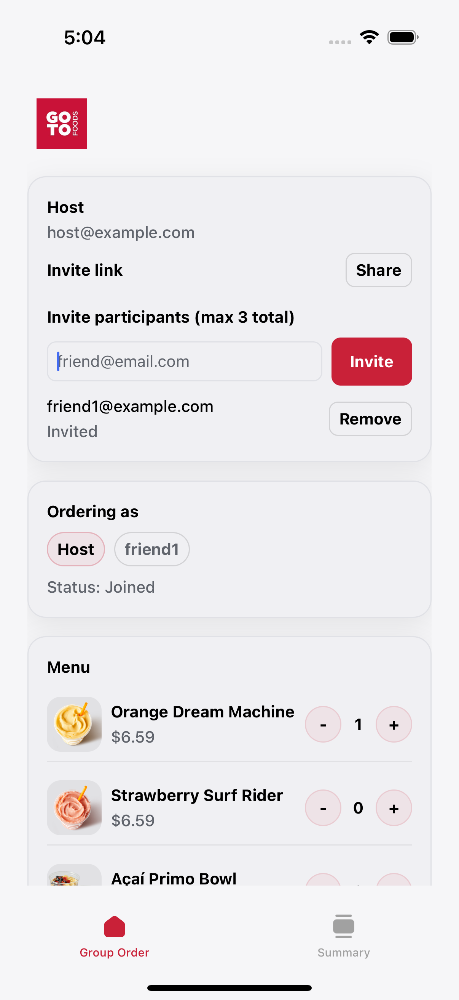
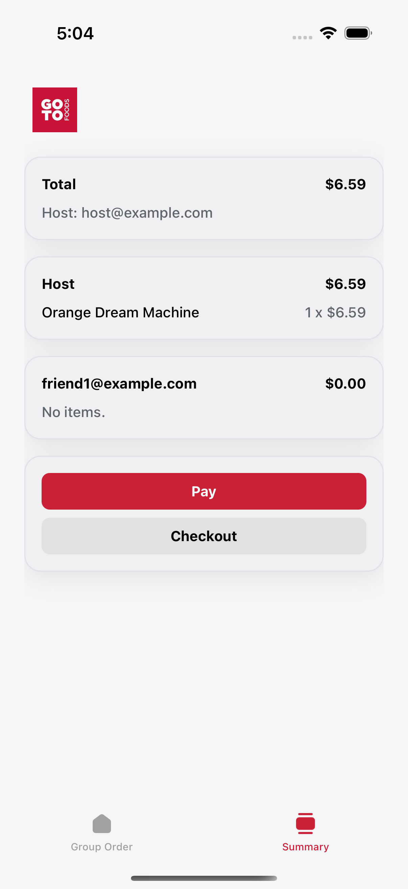
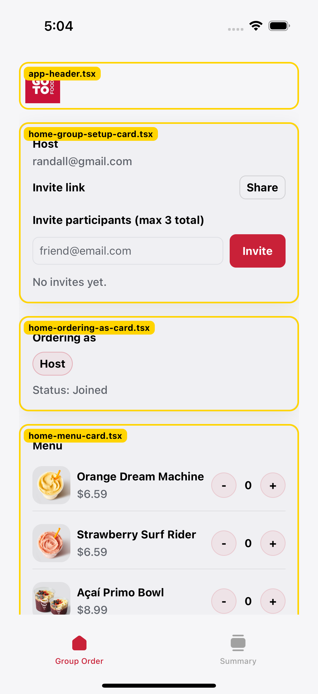

# GoDash

GoDash is a lightweight DoorDash-style group ordering demo built with Expo + React Native.

## Features

- **Group order creation**
  - Start a group with a host email
- **Invite flow (max 3 total participants)**
  - Host + up to 2 invited participants
- **Per-participant carts**
  - Each participant has their own cart
  - Switch who you’re ordering as
- **Menu + product images**
  - Menu items render with thumbnail images
- **Stripe payments (PaymentSheet, test mode)**
  - Host can pay in-app using Stripe PaymentSheet
  - Backend is the source of truth for order totals
- **Join flow + deep link invites**
  - Share a `/join` deep link so participants can join with a group ID
  - Invited participants can join via the Join screen
- **Participant status**
  - Tracks who has joined vs who is still invited
- **Real-time-ish sync**
  - Polls the backend for group updates
- **Anti-spam API actions (in-flight guards)**
  - Disables key buttons while API calls are in flight to prevent duplicate requests
  - Shows in-progress UI labels (e.g. "Creating...", "Inviting...", "Joining...")
- **Invite emails (AWS SES, optional)**
  - Backend can send an invite email on successful invite
  - Disabled by default for the POC
- **Push notifications (Firebase / FCM)**
  - Registers an FCM token per participant
  - Backend sends invites via Firebase Admin (FCM)
- **Basic order constraints**
  - Max quantity per item (backend enforced)
  - Cannot checkout an empty order (backend enforced)
- **Light/Dark theme support**
  - Themed UI components and brand color `#c92138`

## Screenshots

| Start order                                                     | Menu + cart                                              |
| --------------------------------------------------------------- | -------------------------------------------------------- |
|  |  |

| Order summary                                                     | Debug outlines (component labels for debugging)           |
| ----------------------------------------------------------------- | --------------------------------------------------------- |
|  |  |

## Getting started

1. Install dependencies

```bash
npm install
```

2. Start the backend (required for invites/carts/checkout persistence)

```bash
npm run backend
```

3. (Optional) Stripe payments (PaymentSheet)

Stripe PaymentSheet requires a development build (it does not work in Expo Go).

Backend env vars:

- `STRIPE_SECRET_KEY`
- `STRIPE_PUBLISHABLE_KEY`
- `STRIPE_WEBHOOK_SECRET` (optional; only needed if you want webhook verification)
- `STRIPE_API_VERSION` (optional; defaults to `2024-06-20`)

There is a sample file at `backend/.env.example`.

App env vars:

- `EXPO_PUBLIC_STRIPE_PUBLISHABLE_KEY` (same as `STRIPE_PUBLISHABLE_KEY`)

Example:

```bash
STRIPE_SECRET_KEY=sk_test_... STRIPE_PUBLISHABLE_KEY=pk_test_... npm run backend
```

Webhook (optional):

1. Install Stripe CLI

```bash
brew install stripe/stripe-cli/stripe
```

2. Login

```bash
stripe login
```

3. Forward webhooks to your local backend

```bash
stripe listen --forward-to localhost:3001/stripe/webhook
```

The CLI will print a signing secret like `whsec_...`.

4. Start backend with webhook secret

```bash
STRIPE_WEBHOOK_SECRET=whsec_... STRIPE_SECRET_KEY=sk_test_... STRIPE_PUBLISHABLE_KEY=pk_test_... npm run backend
```

4. (Optional) Invite emails via AWS SES

Invite emails are sent by the backend when an invite succeeds.

- **Off by default**: set `SES_SEND_INVITES=true` to enable
- **Required env vars**
  - `AWS_REGION` (or `AWS_DEFAULT_REGION`)
  - `SES_FROM_EMAIL`
  - AWS credentials (standard AWS credential chain)

Example:

```bash
AWS_REGION=us-east-1 SES_FROM_EMAIL=you@yourdomain.com SES_SEND_INVITES=true npm run backend
```

5. (Optional) MongoDB persistence

By default the backend stores group state in memory.
To persist groups across backend restarts, set:

- `MONGODB_URI`
- `MONGODB_DB` (optional; defaults to `godash`)

Example:

```bash
MONGODB_URI="mongodb+srv://..." MONGODB_DB=godash npm run backend
```

6. (Optional) Order constraints

The backend enforces a per-item quantity limit:

- `MAX_QTY_PER_ITEM` (default: `10`)

Example:

```bash
MAX_QTY_PER_ITEM=10 npm run backend
```

7. (Optional) Push notifications (Firebase / FCM)

This project uses Firebase Cloud Messaging (FCM) tokens and sends pushes from the backend using Firebase Admin.

Required files (do not commit):

- `google-services.json` (Android)
- `GoogleService-Info.plist` (iOS)

App identifiers:

- iOS bundle identifier: `com.ridleytech.godash`
- Android package name: `com.ridleytech.godash`

Backend env vars:

- `FIREBASE_SERVICE_ACCOUNT_PATH` (recommended)
  - Use `backend/firebase-service-account.json` and keep it gitignored
- or `FIREBASE_SERVICE_ACCOUNT_JSON`

Notes:

- Expo Go does not support full native push flows; use a development build.
- iOS Simulator won’t receive push notifications.

Dev build:

After adding the Firebase config files, build and install a development client, then start Metro with:

```bash
npx expo start --dev-client
```

8. Start the Expo app

```bash
npx expo start
```

## Backend URL

By default the app uses `http://localhost:3001`.

- **iOS Simulator**: works as-is
- **Real device**: set `EXPO_PUBLIC_BACKEND_URL` to your machine’s LAN IP, e.g.

```bash
EXPO_PUBLIC_BACKEND_URL=http://192.168.1.23:3001 npx expo start --clear
```
