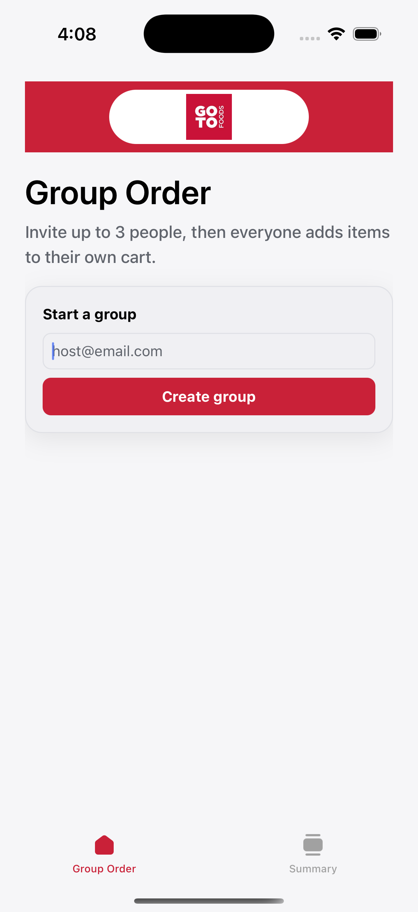
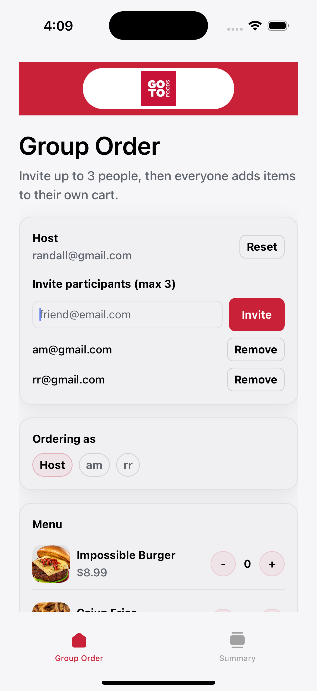
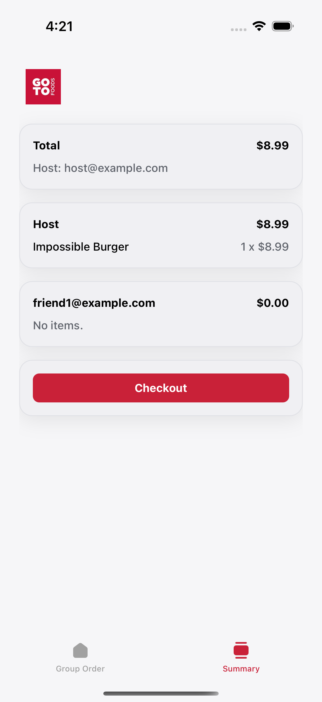

# GoDash

GoDash is a lightweight DoorDash-style group ordering demo built with Expo + React Native.

## Features

- **Group order creation**
  - Start a group with a host email
- **Invite flow (max 3 total participants)**
  - Host + up to 2 invited participants
- **Per-participant carts**
  - Each participant has their own cart
  - Switch who you’re ordering as
- **Menu + product images**
  - Menu items render with thumbnail images
- **Host-only checkout**
  - Summary breakdown by participant
  - Checkout action restricted to host
- **Invite emails (AWS SES, optional)**
  - Backend can send an invite email on successful invite
  - Disabled by default for the POC
- **Push notifications (Expo)**
  - Registers an Expo push token per participant
  - Sends a push notification when an invited participant has a registered token
- **Light/Dark theme support**
  - Themed UI components and brand color `#c92138`

## Screenshots

| Start order                                     | Invites                                 |
| ----------------------------------------------- | --------------------------------------- |
|  |  |

| Menu + cart                       | Order summary                                       |
| --------------------------------- | --------------------------------------------------- |
|  |  |

## Getting started

1. Install dependencies

```bash
npm install
```

2. Start the backend (required for invites/carts/checkout persistence)

```bash
npm run backend
```

3. (Optional) Invite emails via AWS SES

Invite emails are sent by the backend when an invite succeeds.

- **Off by default**: set `SES_SEND_INVITES=true` to enable
- **Required env vars**
  - `AWS_REGION` (or `AWS_DEFAULT_REGION`)
  - `SES_FROM_EMAIL`
  - AWS credentials (standard AWS credential chain)

Example:

```bash
AWS_REGION=us-east-1 SES_FROM_EMAIL=you@yourdomain.com SES_SEND_INVITES=true npm run backend
```

4. (Optional) Push notifications

Push notifications use Expo push tokens.

- iOS Simulator won’t receive push notifications.
- Use a physical device + a dev build for end-to-end testing.

5. Start the Expo app

```bash
npx expo start
```

## Backend URL

By default the app uses `http://localhost:3001`.

- **iOS Simulator**: works as-is
- **Real device**: set `EXPO_PUBLIC_BACKEND_URL` to your machine’s LAN IP, e.g.

```bash
EXPO_PUBLIC_BACKEND_URL=http://192.168.1.23:3001 npx expo start --clear
```
